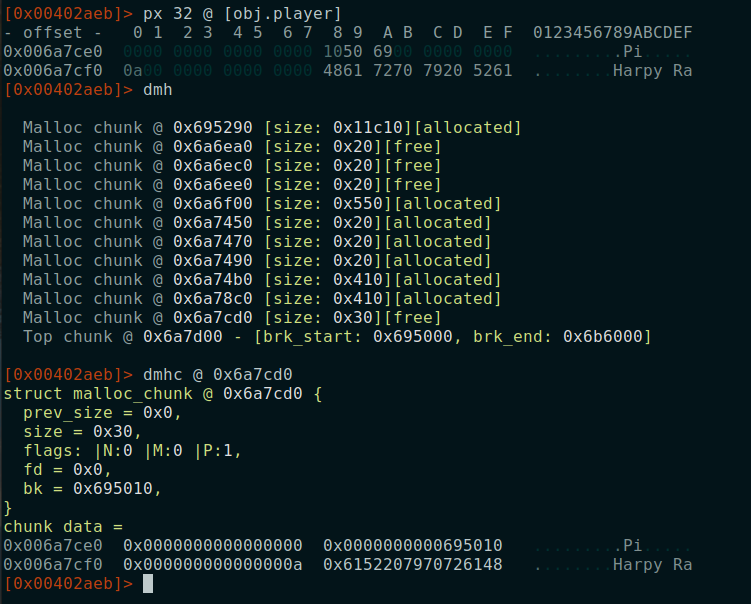

# R2Con CTF 2020

## *mmorpsg* challenge write-up

* Name: mmorpsg
* Level: Easy
* Type: pwn

Since the challenge didn't got many solves, I have created a detailed write-up to explain the entire process from analysis to exploitation. But for those that still would like to give a try, here you have some hints:

* Start analysing the inputs of the program
* There are several vulnerabilities, and therefore, several ways to exploit it
* You can crash the program manually. That will give you an important clue!
* The heap was involved but you don't need to mess with the heap metadata. It is an easy challenge, so keep it simple.
* No need to craft your own shellcode. The challenge gives you what you need.
* Hint released during the CTF with some highlighted words:
> If you want to be the **winner**, just *use* the **table** *after* clean it up.

Let's try to solve it:

~~~
Welcome to the first MMORPSG in the world!
============================================

(MMORPSG = Massively Multiplayer Online Rock-Paper-Scissors Game)

Select an option: 

1. Set your battle nick name
2. Search an online opponent
3. Play
4. Disconnect
~~~

After playing a bit with the options we can see that it is a simple implementation of the rock-paper-scissors game  with three options in the main menu. Let's load the binary in radare and check the `main()` function.

~~~sh
$ r2 -A mmorpsg
s main
pdf
~~~

Despite it is coded in C++ and the function names of the STL are bit annoying, the binary is pretty simple and it is not stripped, so we can quickly identiy the main functions, variables and the menu switch.

Functions of the main menu:

* `sym.set_nickname()`
* `sym.search_player()`
* `sym.play_round()`

## Set player's nickname

The function `sym.set_nickname()` is very simple. First, it requests the length and then the actual nickname but, as we can see, apparently the length is not respected which is a good indicator of a possible **buffer overflow**!

~~~
Enter name length: 10
Enter your new nickname: aaaaaaaaaaaaaaaaaaaaaaaaaaaaaaaaaaaaaaaaaaaaaaaaaaaaaaaaaaaaaaaaaaaaaaaaaaaaaaaaaaaaaaaaaaaaaaaaaaaaaaaaaaaaaaa
Your new nickname is aaaaaaaaaaaaaaaaaaaaaaaaaaaaaaaaaaaaaaaaaaaaaaaaaaaaaaaaaaaaaaaaaaaaaaaaaaaaaaaaaaaaaaaaaaaaaaaaaaaaaaaaaaaaaaa

Welcome aaaaaaaaaaaaaaaaaaaaaaaaaaaaaaaaaaaaaaaaaaaaaaaaaaaaaaaaaaaaaaaaaaaaaaaaaaaaaaaaaaaaaaaaaaaaaaaaaaaaaaaaaaaaaaa
1. Set your battle nick name
2. Search an online opponent
3. Play
4. Disconnect
~~~

Let's reverse the function.

~~~sh
s sym.set_nickname
pdf
~~~

In the first part, basically the function gets an integer from the stdin (using `cin >> var_ch`)and stores the value in `var_ch`.  Then the interesting part is the call to `sym.imp.operator_new__unsigned_long` using the selected length as an argument. This is basically a hidden call to `malloc()` but using the operator `new`. In this case the program is not creating a new object but allocating a buffer. The variable `obj.nickname` will point to the allocated buffer.

~~~c
obj.nickname = new char[length]
~~~

Then it comes the part where the player inputs his nickname:

The function `fcn.00402280` is basically a call to the C++ operator `>>`, so the program reads the nickname using `cin >> obj.nickname`. By definition, the operator `>>` will extract as many characters as possible from the input stream (stdin in this case) and it will insert them into the output buffer (`obj.nickname`). There is no previous call to `cin.width` or `cin.ignore` to limit the number of characters read, so the operator `>>` will continue reading until the end of line, EOF or if an error occurs. This are good news!!! we can cause an overflow and control the size of the buffer allocated.

Just messsing around with the size and the nickname we can start having strange behaviours and errors which clearly confirms there is a **heap overflow vulnerablity** !!!

We can of course confirm this listing the heap chunks with the `dmh` command, before and after setting the nickname:

In the image we can see that a new chunk was allocated `@ 0x1293cd0` with size `0x70` just before the `top chunk`. With the `dmhc` command we confirm that it contains the nickname:

Since it was the last allocation of the program, the memory chunk of the nickname is the last one in the heap, just before the `top chunk`. So if we overflow the nickname buffer, we would be overwriting the `top chunk` and beyond. 

With the heap overflow vunlerability confirmed, we can start messing up with the heap, but wait...this is an **easy** challenge...there should be something else...Let's take a look to the other functions.

### Search another player

This function does not takes any input, but still has some interesting instructions. Apparently it allocates a new object of class `Opponnent`, saving the pointer in `obj.player`.

With the command `av` we can see the vtables of the different C++ classes.

So there are two classes, `Player` and `Opponent` each one with two methods. It looks like the class `Opponent` inherits the method `Player::winner` from the `Player` class.

if we take a look to both functions we can find that:

* `Player::play`: It is just an empty function.
* `Opponent::play`: Returns one char (r, p, s) randomly.
* `Opponent::winner`: WTF??? The code is really interesting. The function calls `system("/bin/sh")` with no reason, but definitily it will be useful to get the flag! :)

### Play the game

The function `sym.play_round()` allows you to play the game, and the first thing it does is to check whether the object `obj.player` is not null. If it is null it shows the message *"You should search a player first"* and redirects you to the main menu. The pointer `obj.player` is allocated in the function `sym.search_player()`, so let's call it with the option 2 of the menu and then come back to this function again.

Nothing fancy here. The programs asks you one option `[r]ock, [p]aper or [s]cissor` to play against the other opponent. Apparently you can play as many rounds as you want. 

~~~
1. Set your battle nick name
2. Search an online opponent
3. Play
4. Disconnect
3

What is your choice? [r]ock, [p]aper or [s]cissor: 
r
	You selected [r] and Maddening Monkey selected [r]
	It is a draw!

Do you want to play again with this player? (y/n)
~~~

After reversing this function a bit, we can see the following:

1. The function checks if `obj.player` is null
2. Requests one option `[r]ock, [p]aper or [s]cissor` to the user. Reads a char from stin and store one char in `var_1fh`.
3. Performs a `call rdx`. The `rdx` value is calculated based on the `obj.player` pointer. The result of the call is stored in `var_1dh`.
4. Shows the message `You selected [r] and Maddening Monkey selected [r]` using `var_1fh`, `obj.player+8` and `var_1dh`.
5. Calls `sym.veredict` and depending on the result, it shows a different message. In this case it was `It is a draw!`
6. Asks you if you want to play another round
7. If not, it calls the destructor of the class `Opponent` (using `obj.player`) and the `delete` operator. Returns to the main menu.

Several things going on here. From the point 4, we can assume that the previous `call rdx` is used to obtian the choice ([r]ock, [p]aper or [s]cissor) of the opponent calling a method of the object `obj.player`. In fact, if we put a breakpoint at `0x00402afb`, we can see that the `call rdx` is really calling the method `Opponent::play()` and we reversed before.

The point 7 is also very interesting. If you say 'No", the program basically destroys the object pointed by `obj.player`. 

Back in the main menu, the opponent has been destroyed, so now we should search another one *BUT* there is nothing that prevents you to play again without searching another player. What will it happen?

~~~
1. Set your battle nick name
2. Search an online opponent
3. Play
4. Disconnect
3

What is your choice? [r]ock, [p]aper or [s]cissor: 
s
Segmentation fault (core dumped)
~~~

**BINGO!** the program crashes! Probably due to the fact that we tried to play against an opponent that was already freed/destroyed. So there might be a possible **User-After-Free (UAF)** vulnerability! The program is using a pointer to an object that has been already freed.

If we review again the instructions when the opponent is destroyed, we can notice that the pointer `obj.player` is never set to NULL. So the pointer will still point to the memory address where the object was stored, even if the object does not exists anymore. Since this pointer is not null, the first check at the beginning of the function `obj.player != null` is true and it allows you to play a round.

Reproducing the crash in radare, we can see that the program crashes just before the instruction `call rdx`, after dereferencing the `obj.player` pointer several times.

These dereferences from `obj.player` are just the way to access the vtable of the object and get the address of the method `Opponent::play()`

~~~

Code:
0x00402aeb      488b15ee6800.  mov rdx, qword [obj.player]  ; rdx = 0x6a7ce0
0x00402af2      488b12         mov rdx, qword [rdx]			; rdx = 0x000000
0x00402af5      488b12         mov rdx, qword [rdx]			; Deferencing 0x0 -> CRASH!!
0x00402af8      4889c7         mov rdi, rax
0x00402afb      ffd2           call rdx

Chain of pointers:
obj.player	 free chunk
0x004093e0 -> 0x6a7ce0 -> 0x00000000 -> CRASH

~~~

The `obj.player` still points to the heap (a free chunk now), but the first qword is `0x0` and when the programs tries to access `[rdx]`, there is a SEGFAULT.

We have a clear UAF vulnerability. Is there any way to control the heap and the value loaded in `rdx`?? If we can control that, we will be able to execute any code reaching `call rdx`. Considering that `obj.player` points to a free chunk, is there anyway to allocate that chunk and put our data?  YES!!! Setting the nickname we can allocate memory chunks of any size and then write our data!! Let's try to reuse the that chunk!

1. Search an opponent
2. Play a round and then finish to destroy the opponent.
3. Check that `obj.player` points to a free chunk. Get the size.
4. Go to the option to set the player's nick name. Select a length similar to the size of the chunk pointed by `obj.player`.
5. Write the the string and check if we can control the value of `obj.player` and then take control at `call rdx`.

Great!!! Just following these steps, we can fully control the value in the heap pointed by `obj.player`!!!

Since we control `obj.player`, now we can try to take control of the execution just where the program crashed:

~~~
0x00402aeb      488b15ee6800.  mov rdx, qword [obj.player]  
0x00402af2      488b12         mov rdx, qword [rdx]			
0x00402af5      488b12         mov rdx, qword [rdx]			
0x00402af8      4889c7         mov rdi, rax
0x00402afb      ffd2           call rdx 
~~~

Since there are several dereferences we need chain pointers to jump to our target address in the `call rdx`. Which address should be use?? There are plenty of options but the program already gives you the answer...

Checking the vtables, both classes `Player` and `Opponent` have a function called `winner` which is never used in the program but it has what we need, a call to `system("/bin/sh")` so definetely, this should be our target!

The plan will take advantage of the UFA vulnerability, write an address in the heap and make sure that after several deferences, `call rdx` will call the `obj.player->Winner()` function. So what should be exact address to be written in `[obj.player]`??

In a normal game, when the opponent object is allocated, `[obj.player]` points to the function `Opponent::play()` in the vtable. Let's just use the address of other entry for `Opponent::winner()`. In the case, the address that we should write with the nickname is `0x00408da0`.

# The Exploit

So after all the explanations, the exploit looks like this:

1. Search an opponent. `1`
2. Play a single round `3`
   1. At the end of the round, answer `no` so the opponent is destroyed
3. Set the user's nickname `1`
   1. Select a length of `36`
   2. Input as nick name the target address `0x00408dc0`
4. Play another round `3`
   1. GET A SHELL

Was not that difficult right? ;) The full exploit in python can be found [HERE](solution.py).

I hope you enjoy playing!!!

